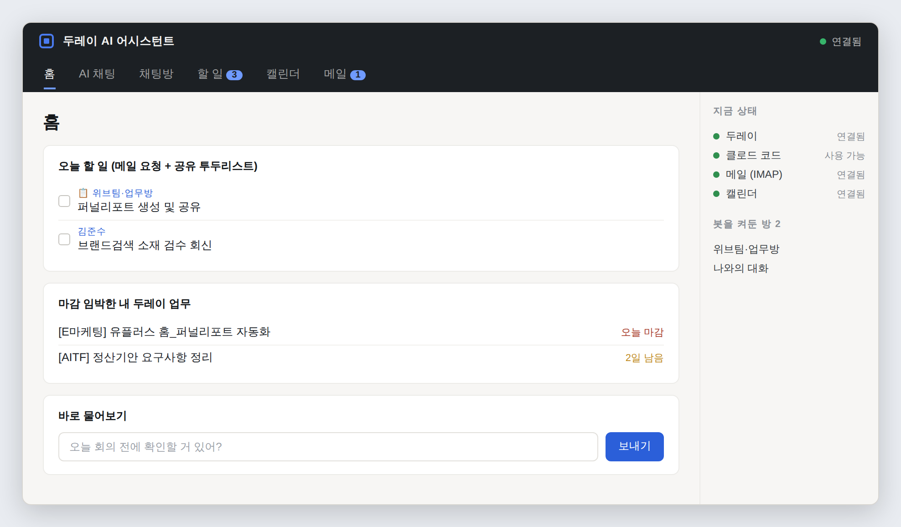
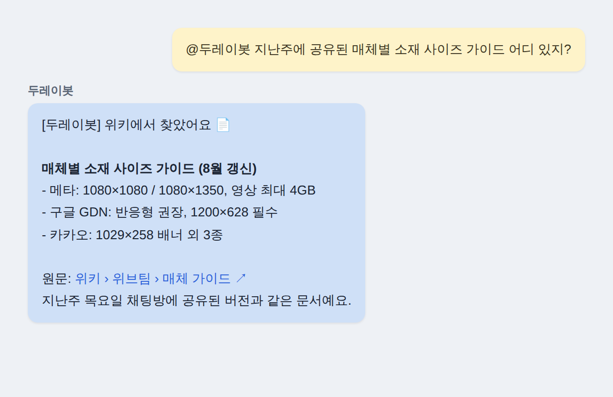
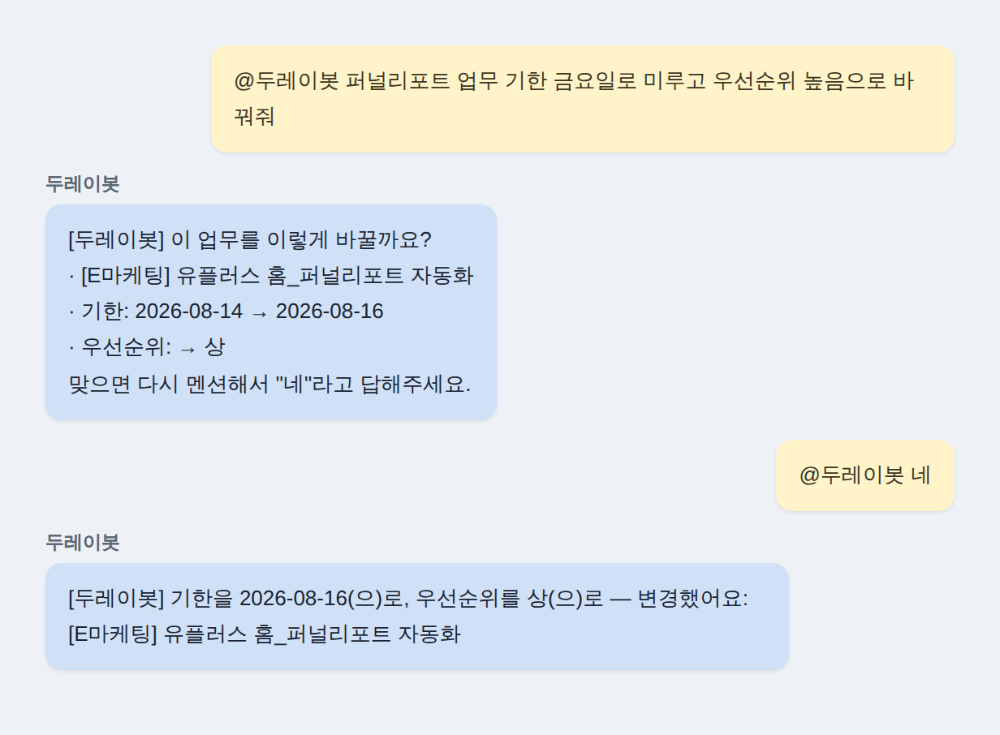
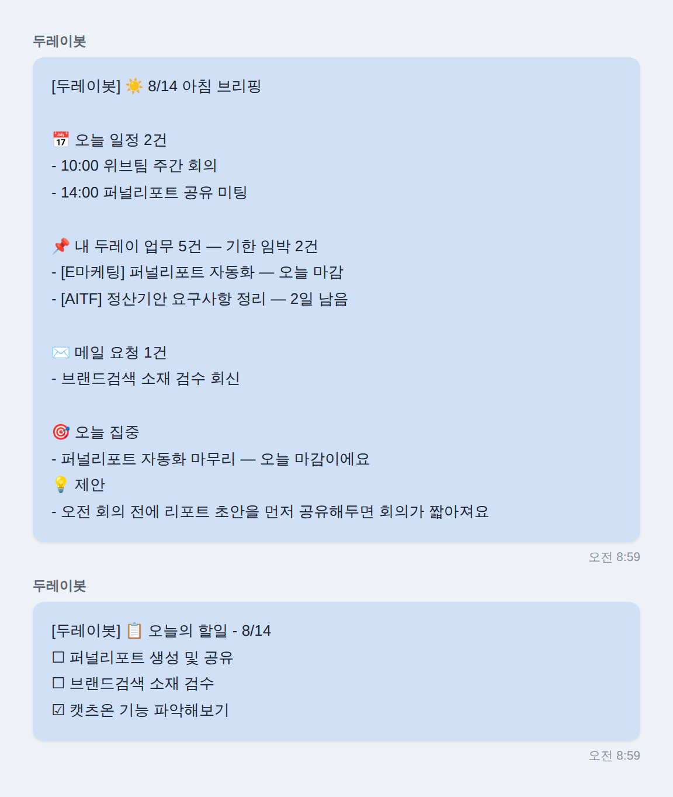
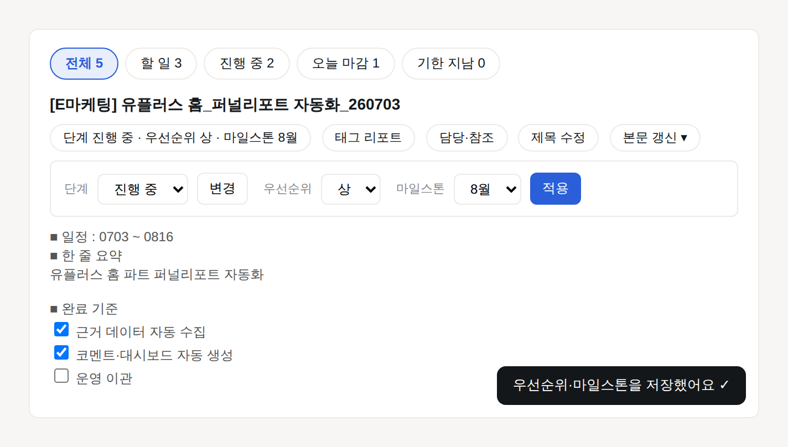
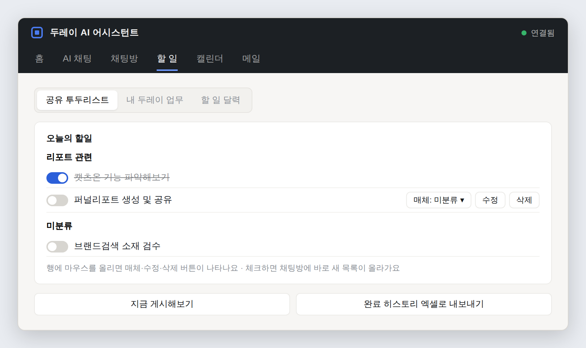
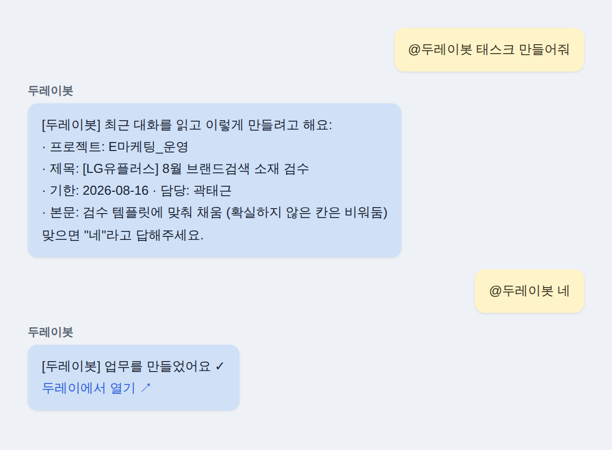
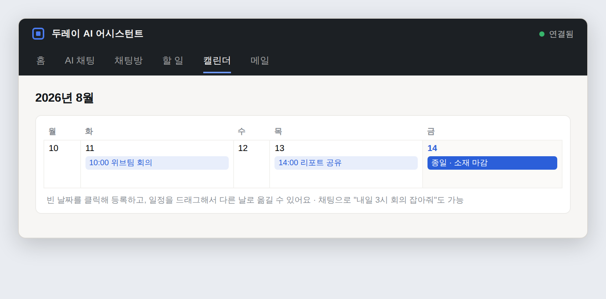
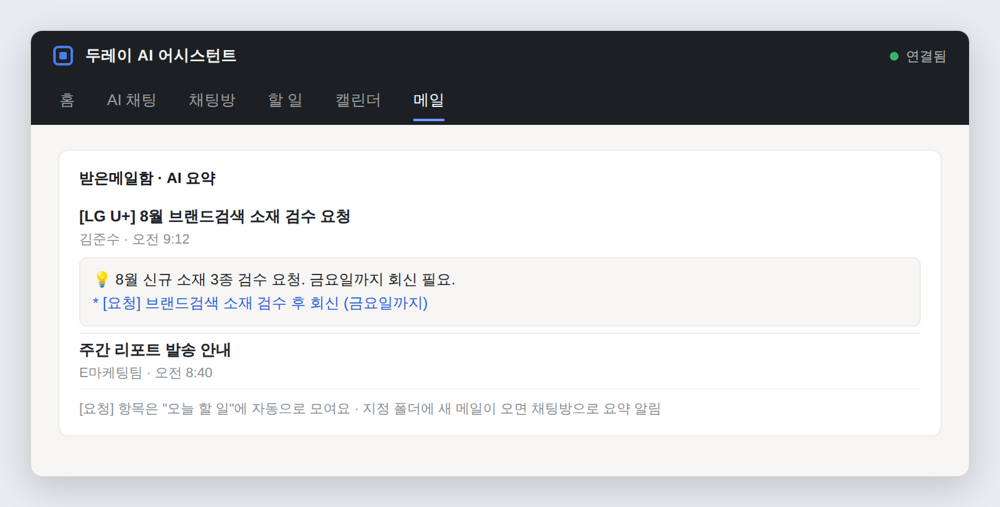

# 두레이 AI 어시스턴트

트레이에 상주하면서 두레이(Dooray)와 클로드 코드(Claude Code)를 연결해주는 마케터용 AI 비서입니다.
두레이 채팅방에서 "@두레이봇"을 부르면 업무·위키·메일·캘린더·드라이브를 조회하고,
말로 시키면 업무의 기한·담당자·단계까지 직접 바꿔줍니다. 아침마다 오늘의 브리핑과 할 일 목록도
채팅방으로 보내줘요.



## 다운로드 / 설치

[GitHub Releases](https://github.com/taegeunsin-web/Dooray-AI-/releases/latest) 에서 최신
설치 파일 (Setup x.x.x.exe) 하나만 다운로드해서 실행하세요.
(latest.yml, .blockmap 파일은 자동 업데이트용 내부 파일이라 무시하셔도 됩니다.)
새 버전이 나오면 이미 설치하신 분들은 앱을 껐다 켤 때 자동으로 업데이트됩니다.

Windows가 "게시자를 알 수 없는 앱" 경고를 띄우면 "추가 정보" → "실행"을 누르면 됩니다
(정식 서명(코드사인) 인증서가 없어서 나오는 정상적인 경고입니다).

### 처음 켤 때 — 두 가지만 준비

1. **클로드 코드(Claude Code) 로그인** — 이 컴퓨터에 클로드 코드가 설치되고 로그인까지
   되어 있어야 AI 기능이 동작합니다. 앱 안 "가이드" 탭에 설치 명령어와 순서가 그대로
   안내되어 있어요. Windows에서는 Git도 함께 설치하는 걸 권장합니다
   ([Git 다운로드](https://git-scm.com/download/win)).
2. **두레이 API 토큰** — 두레이 로그인 후 우측 상단 프로필 → 개인 설정 → API 토큰에서 발급.
   캘린더까지 쓰려면 CalDAV 전용 비밀번호, 메일 기능까지 쓰려면 두레이 웹메일 → 환경설정 →
   IMAP도 함께 준비하세요.

앱을 처음 켜면 뜨는 "설정" 화면에서 위 값을 입력하고 저장하면 끝입니다. 토큰은 이 컴퓨터의
OS 자격 증명 관리자에 안전하게 저장되고, 파일에는 남지 않습니다.

## 주요 기능

### 1. 채팅으로 물어보기

두레이 채팅방에서 "@두레이봇 이번 주 내 태스크 뭐 있어?", "어제 온 메일 요약해줘",
"지난 3월 정산파일 찾아줘"처럼 편하게 물어보면, 두레이 업무·위키·메일·드라이브(연동 시
구글 드라이브까지)를 뒤져서 답해줍니다. 멘션이 오면 그 채팅방의 최근 대화를 즉석 조회해
맥락으로 참고하기 때문에, 프로그램이 꺼져있던 동안의 대화도 이어서 답할 수 있어요.



### 2. 채팅으로 업무 바꾸기

내 담당 업무를 말로 관리할 수 있습니다. 업무를 실제로 바꾸는 명령은 **봇이 먼저 무엇을
어떻게 바꿀지 보여주고, "네"라고 답해야만 실행**돼요. 실행 후에는 정말 바뀌었는지 재확인까지 합니다.

```
OO 업무 완료 처리해줘          OO 업무 진행중으로 바꿔줘 (단계)
OO 업무 기한 금요일로 미뤄줘     OO 업무 담당자 김OO로 바꿔줘
OO 업무 제목 ~로 바꿔줘         우선순위 높음으로 올려줘
태그 리포트 붙여줘             마일스톤 8월로 지정해줘
참조자에 김OO 추가해줘          OO 업무에 3번 끝냈다고 반영해줘 (본문 갱신)
주간 보고서 써줘               내일 3시에 OO 회의 잡아줘 / 옮겨줘 / 취소해줘
```

여러 개를 한 문장으로 말해도 한 번에 처리하고, 사람 이름이 겹치면 사내(nhnad) 계정을
우선으로 찾습니다.



### 3. 아침 브리핑

공유 투두방으로 지정한 채팅방에는 매일 그날 첫 할 일 목록 직전에 **아침 브리핑**이 함께
와요 — 오늘 일정, 내 두레이 업무 기한, 메일 요청을 프로그램이 정확히 모으고, AI가 그걸 읽고
"오늘 집중할 것"과 "제안"을 붙여줍니다. (AI가 실패해도 브리핑 본문은 그대로 나가요)



### 4. 내 두레이 업무 관리 (대시보드)

할 일 탭 → "내 두레이 업무"에서 내가 담당자인 업무를 모아 봅니다.

- 상단 통계(전체/할 일/진행 중/오늘 마감/기한 지남)를 누르면 그 상태만 걸러 보기, 제목 검색
- 업무를 펼치면 본문이 **두레이와 똑같은 모습**으로 렌더링되고, 체크박스를 클릭하면 바로 저장
- 속성 칩을 눌러 단계·우선순위·마일스톤·태그·참조자·제목을 그 자리에서 변경
- "본문 갱신 ▾"에서 수기 수정, "진행상황 한 줄 → AI가 양식 지키며 본문 반영",
  로컬 워크스페이스 문서(정제문서)를 읽어 본문 초안 만들기까지
- 댓글 읽기/쓰기/수정/삭제, 첨부파일 다운로드



### 5. 채팅방 공유 투두리스트

지정한 채팅방에 매일 "오늘의 할일"을 자동 게시합니다. 멘션 없이 "회의 준비 끝냈어요"라고만
해도 완료 처리되고, "7/29 메타 소재 종료 예약"처럼 말하면 새 할 일로 자동 등록돼요.
태그(사람/성격별)와 매체 구분, 드래그 이동, 정기 업무(매일/매주/매월 자동 생성), 메일함
[요청] 자동 포함, 완료 히스토리 엑셀 내보내기까지 지원합니다. 대시보드에서 체크하면
채팅방에도 몇 초 안에 새 목록이 올라가요.



### 6. 업무 만들기

채팅방을 프로젝트+템플릿에 미리 연결해두면 "@두레이봇 태스크 만들어줘"라고만 해도 최근
대화를 읽고 템플릿을 채워 업무를 만들어줍니다. 대시보드의 "빠른 업무 생성"에서는 한 줄만
적으면 AI가 템플릿을 채워 미리보기로 확인 후 생성해요.



### 7. 캘린더 / 메일

- **캘린더**: 채팅으로 일정 등록·변경·취소 (참석자 이름도 알아서 찾아 초대), 대시보드
  월간 달력에서 클릭 등록·드래그 이동
- **메일**: 저장된 메일을 AI 요약과 함께 읽고, [요청] 항목은 "오늘 할 일"로 자동 수집,
  지정 폴더에 새 메일이 오면 채팅방으로 요약 알림




### 8. 그 외

- **상태 레일**: 어느 탭에 있어도 오른쪽에 두레이/클로드/메일/캘린더 연결 상태와 최근 활동이
  보여요 (접기 가능)
- **화면별 인터랙티브 가이드**: 각 화면의 "이 화면 가이드" 버튼으로 튜토리얼 투어
- **자동 업데이트**: 새 릴리즈가 올라오면 앱이 스스로 받아 다음 실행 때 적용
- **안전장치**: 모든 두레이 API 호출은 속도 제한·자동 재시도를 거치고, 쓰기 작업은 성공
  응답 후에도 실제 반영 여부를 재확인합니다

## 참고

- 아키텍처는 사내 오픈소스 Clauday(github.com/limtaewon/dooray-claude-gui-assistance,
  MIT 라이선스)의 Socket Mode / MessengerService / 토큰 저장 방식(keytar) / 채널별 작업폴더
  분리 패턴을 참고했습니다. 두레이 REST API 세부 스펙은 공개 프로젝트
  dooray-cli(github.com/jon890/dooray-cli)를 함께 참고했어요.
- 문서의 이미지는 실제 화면 디자인(v1.0.0)을 재현한 예시 미리보기입니다.
